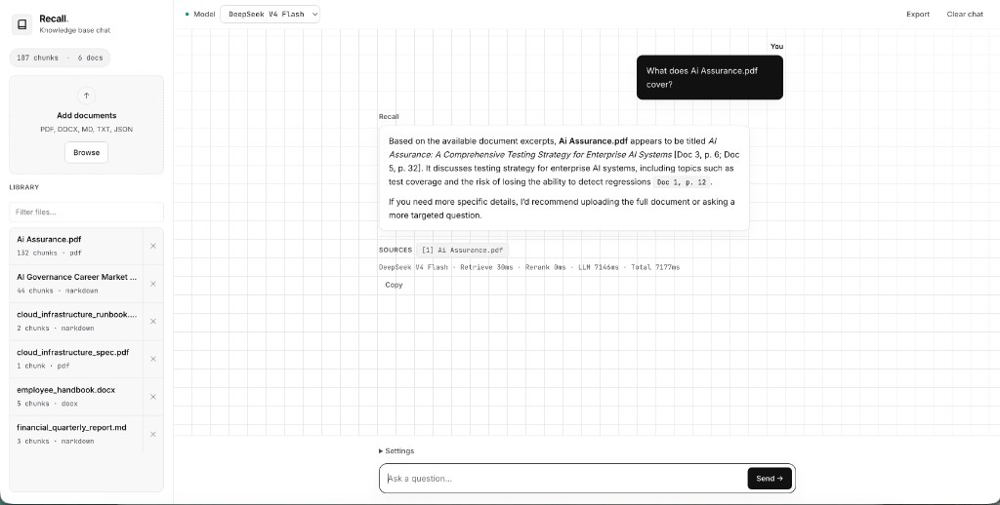

# Recall: The Open-Source, Turnkey Enterprise RAG Platform

[](https://github.com/DTiapan/Recall/actions/workflows/ci.yml)
[](https://python.org)
[](LICENSE)
[](docs/decisions/)
[](https://github.com/astral-sh/ruff)

> **Recall** is a turnkey, open-source Retrieval-Augmented Generation (RAG) platform that deploys in one click with zero setup—providing self-hosted hybrid search, table-aware structural chunking, cross-encoder reranking, and dual-mode local (Ollama) and cloud (LiteLLM) synthesis for enterprise knowledge bases scaling from 1,000 to 10M+ documents.



---

## Key Highlights

- **Zero-Setup Barrier**: Ready out of the box via single-command deployment (`docker compose up` or `recall serve`). No component sprawl or glue scripts required.
- **Embedded Web UI**: Drag-and-drop ingestion, document library with delete, allowlisted model picker (OpenRouter), fast mode, streaming cited answers, and per-stage latency metrics.
- **Dual-Mode Operation**:
  - **Local Mode**: 100% air-gapped, zero-data-leakage execution using [FastEmbed](https://github.com/qdrant/fastembed) (ONNX CPU), [FlashRank](https://github.com/PrithivirajDamodaran/FlashRank) local cross-encoders, and [Ollama](https://github.com/ollama/ollama) (Llama 3.2 / Mistral).
  - **Cloud Mode**: High-capability cloud synthesis using [LiteLLM](https://github.com/BerriAI/litellm) (OpenAI, Anthropic, Gemini, Cohere) with zero local GPU requirements.
- **Enterprise Scale & Precision**:
  - **Structural Format Adapters**: Native ingestion for PDF, Microsoft Word (`.docx`), Markdown, and plain text.
  - **Table Topology Preservation**: Markdown table serialization that retains column headers across sub-chunks without severing numbers.
  - **Deduplication Gate**: 64-bit `xxhash` exact deduplication (<100MB RAM for 10M docs) + MinHash LSH for near-duplicate filtering.
  - **Concurrent Hybrid Retrieval**: Dense HNSW vector similarity in Qdrant fused with BM25+ lexical search via Reciprocal Rank Fusion (RRF, $k=60$) with circuit breaker fallbacks.
  - **Cross-Encoder Reranking & Compression**: Zero-GPU ONNX cross-encoders with extractive sentence reduction to eliminate prompt bloat and prevent "Lost in the Middle" attention failures.
  - **Context Sandboxing & Citation Verification**: Untrusted document passages sandboxed in XML tags (`<context_document>`) with strict inline citation verification (`[Doc X, p. Y]`).

---

## Architecture Overview

```
┌─────────────────────────────────────────────────────────────────────────────┐
│                          RECALL PLATFORM ARCHITECTURE                       │
│                                                                             │
│  [Embedded Web UI]             [FastAPI REST Engine]         [Recall CLI]   │
│  - Drag & Drop Ingest          - POST /v1/ingest             - recall serve │
│  - Verified Citation Pills     - POST /v1/search             - recall ingest│
│  - Real-time Diagnostics       - POST /v1/chat               - recall query │
│         │                               │                           │       │
│         └───────────────────────┬───────┴───────────────────────────┘       │
│                                 ▼                                           │
│  ┌───────────────────────────────────────────────────────────────────────┐  │
│  │                     RECALL CORE ORCHESTRATION PIPELINE                │  │
│  │                                                                       │  │
│  │  1. Format Ingestion Engine (PDF, DOCX, Markdown, Table Formatter)    │  │
│  │  2. Exact & Near Deduplication (xxhash + MinHash LSH)                 │  │
│  │  3. Concurrent Hybrid Retrieval (Dense HNSW + BM25+ Sparse)           │  │
│  │  4. Reciprocal Rank Fusion (RRF, k=60) with Dense Circuit Breakers    │  │
│  │  5. Cross-Encoder Reranking (FlashRank ONNX) + Threshold Gating       │  │
│  │  6. Extractive Context Compression (Saliency Extractor)               │  │
│  │  7. XML Context Sandboxing & Prompt Injection Defense                 │  │
│  │  8. LiteLLM Universal Synthesis + Grounded Citation Verification      │  │
│  └───────────────────┬───────────────────────────────┬───────────────────┘  │
│                      │                               │                      │
│                      ▼                               ▼                      │
│  ┌─────────────────────────────────┐   ┌─────────────────────────────────┐  │
│  │      STORAGE & VECTOR ENGINE    │   │        LLM & EMBEDDING GATEWAY  │  │
│  │      (Qdrant Unified OSS)       │   │        (LiteLLM + FastEmbed)    │  │
│  │  - Dense HNSW Index             │   │  [Local Mode]:                  │  │
│  │  - Native Sparse BM25+ Index    │   │  - FastEmbed ONNX (bge-small)   │  │
│  │  - Scalar Quantization (INT8)   │   │  - FlashRank ONNX Reranker      │  │
│  │  - Multi-tenant Collections     │   │  - Ollama (Llama-3 / Mistral)   │  │
│  │                                 │   │  [Cloud Mode]:                  │  │
│  │                                 │   │  - OpenAI, Claude 3.5, Gemini   │  │
│  └─────────────────────────────────┘   └─────────────────────────────────┘  │
└─────────────────────────────────────────────────────────────────────────────┘
```

---

## Quickstart

### Option A: Turnkey Single-Command Docker Deployment (Recommended)

```bash
# Clone the repository
git clone https://github.com/DTiapan/Recall.git
cd Recall

# Launch complete stack (FastAPI + Qdrant + Web UI)
docker compose up -d

# Open the Web UI in your browser
open http://localhost:8000
```

### Option B: Local Python CLI

```bash
# Clone and enter directory
git clone https://github.com/DTiapan/Recall.git
cd Recall

# Create virtual environment and install
uv venv
source .venv/bin/activate
uv pip install -e ".[formats]"

# Copy environment configuration
cp .env.example .env

# Start the server and embedded Web UI
recall serve
```

---

## Command-Line Interface (CLI)

```bash
# Start the API and UI server
recall serve --host 0.0.0.0 --port 8000

# Ingest any document into the active collection
recall ingest path/to/document.pdf --collection documents

# Query the pipeline directly from the terminal
recall query "What are the production access requirements?"

# Run retrieval benchmarks on real-world datasets
recall benchmark --dataset sample
uv pip install -e ".[benchmark]"
RAG_MODE=local recall benchmark --dataset beir:scifact --limit 500
```

---

## Retrieval Benchmarks

Recall evaluates hybrid retrieval on **real-world corpora** with human relevance labels — not synthetic templates. See [ADR-013](docs/decisions/0013-real-world-benchmark-datasets.md).

**Full benchmark narrative** (expected results, improvements, scale roadmap to 10M+): [docs/benchmarks/README.md](docs/benchmarks/README.md).

**Environment:** `RAG_MODE=local`, FastEmbed `BAAI/bge-small-en-v1.5` (dense + sparse), disk-backed Qdrant (`~/.cache/recall/benchmark-indexes/`), Apple Silicon CPU (Sep 2026). Fair subsample: qrels-aware + `--subsample-seed 42` (not first-N dict order).

| Dataset | Docs | Queries | HitRate@5 | nDCG@10 | MRR | Rerank HR@5 |
|---|---:|---:|---:|---:|---:|---:|
| [Bundled sample](data/sample/) (MD, DOCX, PDF) | 5 | 10 | **100.0%** | — | **0.875** | **100.0%** |
| [BEIR SciFact](https://github.com/beir-cellar/beir) @500 | 500 | **300** | **91.0%** | **0.860** | **0.839** | — |
| [BEIR FiQA](https://github.com/beir-cellar/beir) @500 | 500 | **500** | **78.8%** | **0.722** | **0.686** | — |
| [BEIR FiQA](https://github.com/beir-cellar/beir) @10k | 10,000 | **648** | **73.8%** | **0.522** | **0.614** | **72.1%** |

Sample benchmark also reports query P50 **40 ms** and rerank P50 **60 ms** on local FastEmbed (Sep 2026).

FiQA @10k (`batch_size=128`, disk index, `--rerank`, Sep 2026): ingest **14.9 docs/sec** (~11 min), peak RSS **14.8 GB**, query P50 **247 ms**, rerank P50 **1608 ms** (pool=50). Reports: [fiqa-10k-ap003-rerank](docs/benchmarks/fiqa-10k-ap003-rerank.md) (current), [fiqa-10k](docs/benchmarks/fiqa-10k.md) (pre-fix baseline).

```bash
# Bundled enterprise corpus (no extra deps, no network)
RAG_MODE=local recall benchmark --dataset sample

# Standard IR benchmark (downloads ~2.7 MB on first run; index persisted for reuse)
uv pip install -e ".[benchmark]"
RAG_MODE=local recall benchmark --dataset beir:scifact --limit 500 --subsample-seed 42

# Scale tier (batched embed + bulk upsert; re-run skips ingest when manifest matches)
RAG_MODE=local recall benchmark --dataset beir:fiqa --scale 10k --batch-size 128 --rerank --subsample-seed 42

# High-throughput scale stress (100k–10M index/latency, mock embeddings — not IR quality)
RAG_MODE=local recall benchmark --dataset beir:fiqa --scale 100k --fast --in-memory
```

---

## Challenges, learnings & what we improved

Building a production RAG stack surfaced real failures long before “model quality” was the bottleneck. We document the full trail in the [engineering ledger](docs/engineering-ledger/INDEX.md) (lessons, tactical decisions, attack plans). Below is the public summary — not buried in ADRs alone.

### Improvements so far

| Area | Before | Now |
|------|--------|-----|
| **Eval correctness** | 0% HitRate@5 on SciFact (label mismatch) | **91%** HR@5 @500 docs with preserved BEIR `doc_id` |
| **Scale ingest** | ~13 min projected for FiQA@10k at batch=1 | **~11 min** @ batch=128; disk-persisted indexes with manifest reuse |
| **Rerank fairness** | Rerank path filtered at 0.35; hybrid unfiltered → false regression | Split `reranking.score_threshold` (default **null**); FiQA@10k rerank within **1.7pp** of hybrid |
| **Metrics** | Custom HitRate@5 only | **pytrec_eval** (nDCG@10, MRR@10) + fair qrels-aware subsample |
| **CI gate** | Tests only | **pytest + sample benchmark** (`--min-hit-rate 0.90`) on every PR |
| **Web UI** | Dark prototype, no streaming | Light production UI: **streaming SSE**, allowlisted **model picker**, doc **delete**, fast mode, per-stage **latency** |
| **Synthesis** | Local Ollama only | **OpenRouter** via LiteLLM; reasoning leak suppressed; markdown answers |

### Challenges we hit (and how we fixed them)

1. **Benchmark labels ≠ indexed IDs** — `ingest_text` hashed `source_uri` into `doc_id`, breaking qrel joins. *Fix:* pass explicit `doc_id` through ingest; fallback `relevant_sources` matching. ([LL-001](docs/engineering-ledger/lessons.md))
2. **“Rerank is worse than hybrid”** — looked like a bad cross-encoder; was asymmetric `score_threshold` on rerank only. *Fix:* separate rerank threshold; rank-only default; wire FlashRank model from config. ([LL-003](docs/engineering-ledger/lessons.md), [investigation](docs/benchmarks/retrieval-quality-investigation.md))
3. **10k ingest too slow** — per-document ONNX + Qdrant round-trips. *Fix:* `ingest_chunks_batched` @ 128; `--fast` mode for million-scale stress only. ([LL-002](docs/engineering-ledger/lessons.md))
4. **Re-running benchmarks re-embedded everything** — partial Qdrant dirs without manifest. *Fix:* disk slots under `~/.cache/recall/benchmark-indexes/` with `manifest.json` + `subsample.json`. ([DR-004](docs/engineering-ledger/decisions.md))
5. **UI felt broken at demo time** — temp filenames in library, stale model badge, reasoning in chat, 14s latency opaque. *Fix:* `source_uri` on upload, `/v1/config` model allowlist, stream only `content`, latency footer + fast mode (skip ~1.5s rerank).

### Key learnings (reusable)

- **Eval label keys must match indexed metadata** — never substitute convenience hashes for benchmark `doc_id`. (universal)
- **Never threshold only one retrieval path** — hybrid vs rerank comparisons require identical gating. (universal)
- **Rerank wins are dataset-specific** — FiQA may gain; SciFact/NFCorpus can regress; tune per domain, not “always on.” ([LL-005](docs/engineering-ledger/lessons.md), open)
- **Report community metrics** — nDCG@10 / Recall@10 when citing BEIR; subsample methodology matters as much as the number.
- **Latency is pipeline-shaped** — typical chat: retrieve **&lt;200ms**, rerank **~1.5s**, LLM **~5–12s**; optimize the dominant stage first.
- **Turnkey means operable UI** — admins need allowlisted models and doc lifecycle without editing `.env` per demo.

### What we're working on next

- **AP-003 Phase C** — reranker model comparison (BGE vs FlashRank), hybrid weight grid, long-doc chunking ([attack plan](docs/engineering-ledger/attack-plans.md))
- **Scale** — 100k+ `--fast` stress tier; streaming ingest for 1M+ docs
- **Ship** — green CI on `main`; optional OpenTelemetry export in production compose

Deeper write-ups: [retrieval quality investigation](docs/benchmarks/retrieval-quality-investigation.md) · [FiQA@10k rerank report](docs/benchmarks/fiqa-10k-ap003-rerank.md) · [all lessons](docs/engineering-ledger/lessons.md)

---

## REST API Reference

| Endpoint | Method | Description |
|---|---|---|
| `/` | `GET` | Embedded Web UI (upload, chat, citations) |
| `/v1/health` | `GET` | Healthcheck, active model, embedding dimensions |
| `/v1/config` | `GET` | UI config: model allowlist, pipeline defaults |
| `/v1/documents` | `GET` / `DELETE` | List or remove indexed documents by `source_uri` |
| `/v1/stats` | `GET` | Indexed chunk counts and storage metrics |
| `/v1/ingest` | `POST` | Upload files (PDF, DOCX, MD, TXT, JSON) or raw text |
| `/v1/search` | `POST` | Hybrid search (dense + sparse) with RRF fusion |
| `/v1/chat` | `POST` | Full RAG pipeline; optional `stream`, `model`, `rerank` |

---

## Architecture Decision Records (ADRs)

Every architectural milestone in Recall is documented prior to implementation:

| ADR | Title | Status |
|---|---|---|
| [ADR-001](docs/decisions/0001-record-architecture-decisions.md) | Record Architecture Decisions | Accepted |
| [ADR-002](docs/decisions/0002-production-rag-architecture.md) | Production RAG Architecture and Technology Stack | Accepted |
| [ADR-003](docs/decisions/0003-ingestion-and-chunking-strategy.md) | Ingestion and Structural Chunking Strategy | Accepted |
| [ADR-004](docs/decisions/0004-format-aware-chunking-adapters.md) | Format-Aware Chunking Adapters and Table Serialization | Accepted |
| [ADR-005](docs/decisions/0005-turnkey-enterprise-rag-platform.md) | Turnkey Enterprise RAG Platform Positioning and Brand | Accepted |
| [ADR-006](docs/decisions/0006-vector-storage-and-indexing.md) | Production Qdrant Storage, INT8 Quantization, and FastEmbed | Accepted |
| [ADR-007](docs/decisions/0007-hybrid-retrieval-and-fusion.md) | Concurrent Hybrid Retrieval, Reciprocal Rank Fusion, and Circuit Breakers | Accepted |
| [ADR-008](docs/decisions/0008-reranking-and-quality-filtering.md) | Cross-Encoder Reranking, Threshold Gating, and Context Compression | Accepted |
| [ADR-009](docs/decisions/0009-synthesis-and-guardrails.md) | Context Sandboxing, Injection Defense, LiteLLM, and Citation Verification | Accepted |
| [ADR-010](docs/decisions/0010-turnkey-rest-api-and-web-ui.md) | Turnkey REST API, Embedded Web UI, and CLI Tooling | Accepted |
| [ADR-011](docs/decisions/0011-packaging-and-production-hardening.md) | Multi-Stage Hardened Dockerfile and Compose Orchestration | Accepted |
| [ADR-012](docs/decisions/0012-synthetic-corpus-and-scale-benchmarking.md) | Synthetic Enterprise Corpus Generation and Multi-Scale Stress Benchmarking | Accepted |
| [ADR-013](docs/decisions/0013-real-world-benchmark-datasets.md) | Real-World Benchmark Datasets (BEIR + Curated Corpus) | Accepted |
| [ADR-014](docs/decisions/0014-ui-model-allowlist.md) | UI Model Allowlist and Per-Request Synthesis Override | Accepted |

---

## Running the Test Suite

CI runs on every push/PR to `main` — [view workflow runs](https://github.com/DTiapan/Recall/actions/workflows/ci.yml) (badge at top of this README).

**What CI runs** ([`.github/workflows/ci.yml`](.github/workflows/ci.yml)):

| Step | Gate |
|------|------|
| `pytest` | 125 unit/integration tests (smoke excluded) |
| `recall benchmark --dataset sample --in-memory` | HitRate@5 ≥ **90%**, MRR ≥ **0.60** |

Reproduce the retrieval gate locally:

```bash
pip install -e ".[formats,dev,benchmark]"
RAG_ENV=test RAG_MODE=local pytest -q
RAG_ENV=test RAG_MODE=local recall benchmark --dataset sample --in-memory \
  --min-hit-rate 0.90 --min-mrr 0.60
```

```bash
# Fast parallel unit/integration suite (smoke tests excluded by default)
pytest

# Docker deployment smoke test (requires Docker)
pytest -m smoke -n 0 -v

# Export traces to an OTLP collector (optional)
export OTEL_EXPORTER_OTLP_ENDPOINT=http://localhost:4318
```

---

## Built with open tooling

Recall is the **product** in a three-repo stack for serious GenAI engineering:

| Project | Role |
|---------|------|
| **Recall** (this repo) | Production RAG: ingest, hybrid retrieval, real BEIR evals |
| [Craft](https://github.com/DTiapan/craft) | Workflow router + [engineering ledger](docs/engineering-ledger/INDEX.md) (decisions, lessons, phase gates) |
| [Battery](https://github.com/DTiapan/battery) | Local MCP agent memory (hybrid search, `BATTERY.md` in git) |

Craft is adopted in this repo (`docs/engineering-ledger/`, [setup guide](docs/craft-setup.md)). Battery complements agent session memory while Recall handles document retrieval.

---

## Author

**Ajas Bakran** — AI systems engineer focused on agent evaluation, context engineering, and production reliability.

- GitHub: [github.com/DTiapan](https://github.com/DTiapan)
- LinkedIn: [linkedin.com/in/ajasbakran](https://linkedin.com/in/ajasbakran)
- Newsletter: [growithai.substack.com](https://growithai.substack.com/)

Advisory and consulting on AI agent reliability, memory architectures, MCP integrations, and production RAG — [get in touch](mailto:bakran.ajas@gmail.com).

---

## License

MIT License. See [LICENSE](LICENSE) for details.
